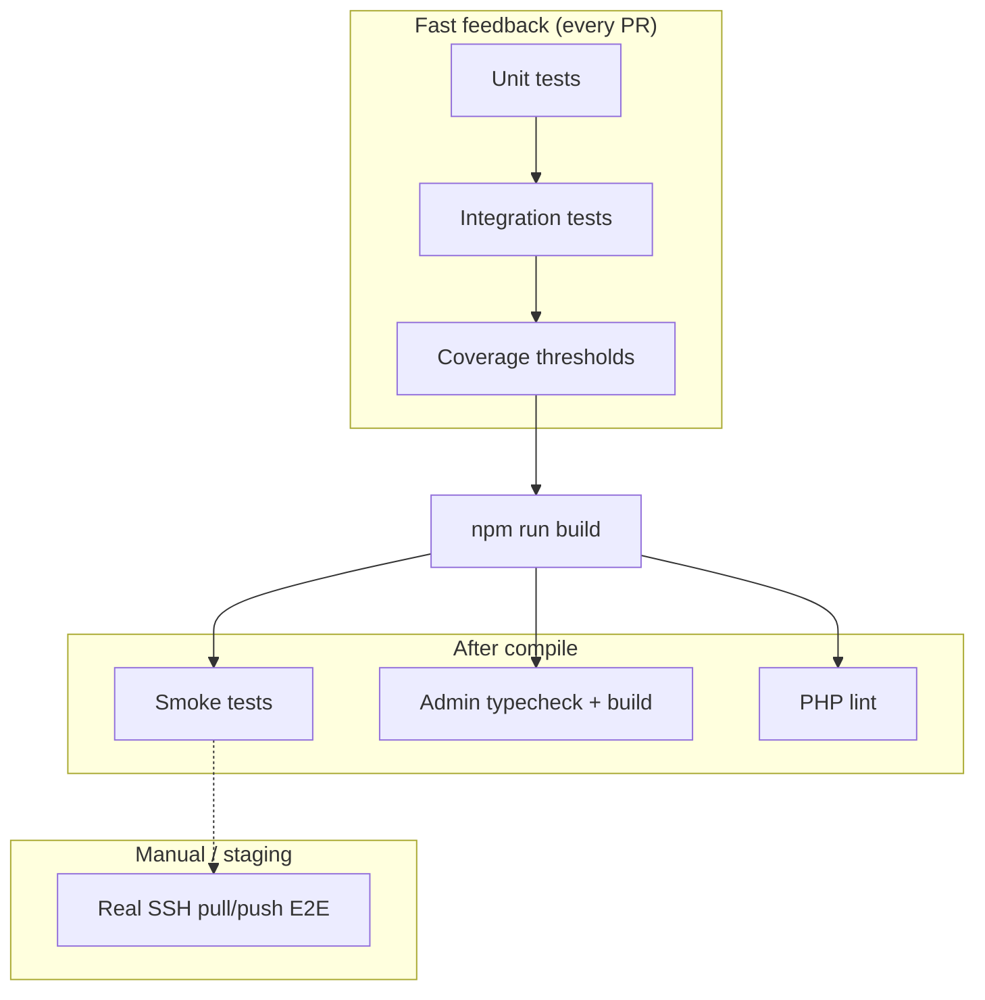

# WP-dev testing guide

Automated tests guard the CLI, sync engine, config validation, and deployment safety rules. Run them before every release and on every pull request (see CI).

## Quick commands

| Command | Purpose |
| ------- | ------- |
| `npm test` | Unit + integration tests (fast, no build required) |
| `npm run test:coverage` | Same suite with V8 coverage report |
| `npm run test:smoke` | Post-build smoke tests (`dist/cli.js` must exist) |
| `npm run test:all` | Unit/integration → build → smoke |

## Audit snapshot

| Area | Status | Notes |
| ---- | ------ | ----- |
| Unit tests | ✅ Present | `tests/*.test.ts` — config, sync excludes, permissions, URLs, logger, backup |
| Integration tests | ✅ Present | `tests/sync-engine.integration.test.ts`, sync safety, pull/push guards |
| Smoke tests | ✅ Present | `tests/smoke/` — CLI help, command registration, sync-rules |
| End-to-end tests | ⚠️ Partial | Real SSH/rsync/Docker E2E not in CI (needs secrets + long runtime); smoke + integration cover core logic |
| CI | ✅ Present | `.github/workflows/ci.yml` — check, test, coverage, build, smoke, admin, PHP lint |
| Coverage reports | ✅ Present | `npm run test:coverage` → `coverage/lcov.info` |
| Fixtures | ✅ Present | `tests/helpers/fixtures.ts` — minimal config + fake WordPress tree |
| Mocks | ✅ Used | Vitest timers for backup timestamps; temp dirs instead of real SSH |

## Architecture



### Unit tests

Fast, deterministic tests for pure functions and small modules:

- Config schema and JSON schema artifacts
- Sync exclude compilation, plugin/theme units, preview parsing
- Permissions shell builders, URL helpers, backup naming
- CLI argument parsing (`parseSyncDirection`)

### Integration tests

Workflow-level tests with temp filesystem fixtures:

- `applySyncRecommendations`, `buildStaysLocalSummary`, safety warnings
- Sync config normalization and `.wp-dev/sync-excludes`
- Performance guard for many plugin exclude rules

### Smoke tests

Run **after** `npm run build`:

- `dist/cli.js` exists and `--help` lists sync commands
- `sync-rules` runs against repo config
- Docker runners expose `wpdev_sync_*` actions

### End-to-end strategy

Full pull/push over SSH is validated manually on staging servers. Automated E2E would require:

- Ephemeral SSH host or Testcontainers
- WordPress + rsync in CI (15+ min, flaky on network)

Until that infrastructure exists, high-risk paths are covered by unit/integration tests plus smoke verification of the built CLI.

## Folder layout

```
tests/
├── helpers/fixtures.ts      # Shared config + WordPress tree builders
├── smoke/                   # Post-build smoke suite
├── *.test.ts                # Unit + integration by domain
└── README.md                # This file
```

## Coverage goals

| Layer | Target | Enforced in vitest.config.ts |
| ----- | ------ | ---------------------------- |
| Services + utils + config | ~40% baseline (growing) | Global thresholds on testable layers |
| Sync excludes | 75%+ | Per-file threshold |
| Sync units | 90%+ | Per-file threshold |
| Preview parse | 84%+ | Per-file threshold |
| CLI commands (push/pull/ssh) | Smoke + manual E2E | Excluded from coverage thresholds |

Raise global thresholds as coverage improves. Do not chase 100% on CLI glue or Docker scripts.

## Adding tests

1. Prefer `tests/helpers/fixtures.ts` for config and WordPress directories.
2. Put pure-function tests next to related files (`sync-*.test.ts`).
3. Use `mkdtempSync` + `rmSync` in `afterEach` for filesystem tests.
4. Smoke tests belong in `tests/smoke/` only.
5. Mock time with `vi.useFakeTimers()` for timestamped filenames.

## Remaining gaps

- **UI (admin React):** Vitest covers config validation; component/wizard tests still optional.
- **SSH/rsync E2E:** mocked unit + orchestration tests cover logic; real SSH host E2E still manual.
- **Docker compose up:** doctor/full stack smoke optional for local dev only.
- **Corrupted backup restore:** covered partially via `assertBackupFileExists`; full restore flow needs fixture DB dumps.

## New test files (coverage hardening)

| File | Covers |
| ---- | ------ |
| `tests/rsync-compose-env.test.ts` | rsync pull/push (mocked execa), compose-env helpers |
| `tests/ssh.test.ts` | SSH connect attempts, connectSsh |
| `tests/confirm.test.ts` | Production/staging confirmation prompts |
| `tests/http-probe.test.ts` | Doctor HTTP redirect probing |
| `tests/sync-preview-wpcli.test.ts` | Sync preview + wpcli helpers |
| `tests/pull-push-orchestration.test.ts` | cmdPull/cmdPush dry-run guards |
| `docs/admin/src/validateConfig.test.ts` | Admin JSON schema validation |

## CI pipeline

On every push/PR to `main`:

1. `npm ci` → `npm run check`
2. `npm test` → `npm run test:coverage`
3. `npm run build` → `npm run test:smoke`
4. Admin typecheck/build + PHP syntax check

Build fails on test regression or coverage below configured thresholds.
